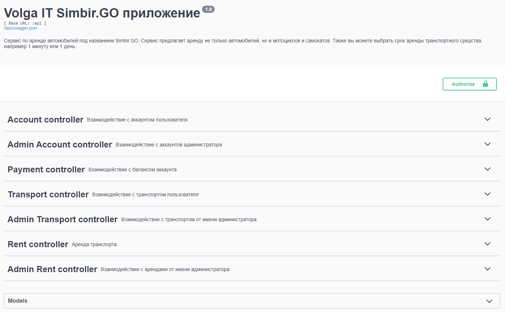
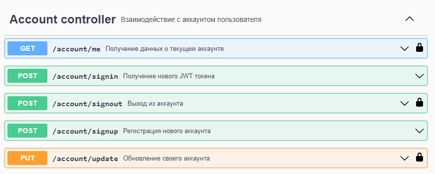

# Описание проекта

## Волга IT - Задание полуфинального этапа

В данном задании необходимо разработать сервис по аренде автомобилей
под названием “Simbir.GO”. Сервис предлагает аренду не только автомобилей, но и
мотоциклов, а также самокатов. Можно выбрать срок аренды транспортного
средства, например 1 минуту или 1 день.

В решении должна использована база данных Postgres. Авторизация пользователя 
осуществляется с помощью JWT (Json Web Token). Для проверки приложения 
сконфигурирован Swagger и с возможностью авторизации по JWT.

Swagger (http://127.0.0.1:5000/)



### Account Controller API



### Admin Account Controller API


### Payment Controller API


### Transport Controller API


### Admin Transport Controller API


### Rent Controller API


### Admin Rent Controller API


# Структура проекта

```
├───app
│   ├───apis
│   │   ├───accounts
│   │   ├───payments
│   │   ├───rents
│   │   └───transports
│   ├───configs
│   ├───core
│   │   ├───accounts
│   │   │   └───utils
│   │   ├───payments
│   │   ├───rents
│   │   └───transports
│   └───extensions
│       ├───database
│       │   ├───models
│       │   └───schemas
│       └───jwt
├───description 
└───tests  
```

Описание:
- В apis находится описание API в Swagger;
- В configs находятся конфиги для тестирования / отладки;
- В core находится бизнес-логика приложения;
- В extensions находятся сторонние библиотеки для Flask (ORM, JWT, ... );
- В test находятся unit-тесты для проверки корректной работы контроллеров.

# Запуск проекта 
```
docker compose up --build -d
```

Документация Swagger: http://127.0.0.1:5000


# Тестирование
Были протестированы следующие контроллеры:

- Account Controller
- Admin Account Controller
- Payment Controller
