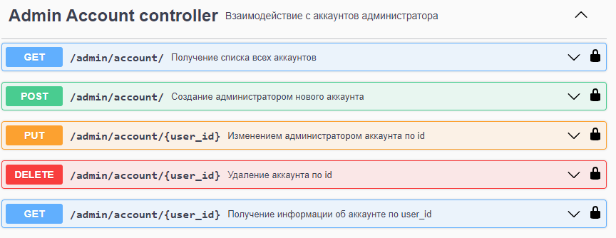

# Описание проекта

## Волга IT - Задание полуфинального этапа

В данном задании необходимо разработать сервис по аренде автомобилей
под названием “Simbir.GO”. Сервис предлагает аренду не только автомобилей, но и
мотоциклов, а также самокатов. Можно выбрать срок аренды транспортного
средства, например 1 минуту или 1 день.

В решении должна использована база данных Postgres. Авторизация пользователя 
осуществляется с помощью JWT (Json Web Token). Для проверки приложения 
сконфигурирован Swagger и с возможностью авторизации по JWT.

Swagger (http://127.0.0.1:5000/)


### Account Controller API


### Admin Account Controller API



### Payment Controller API


### Transport Controller API


### Admin Transport Controller API


### Rent Controller API


### Admin Rent Controller API


# Структура проекта

```
├───app
│   ├───apis
│   │   ├───accounts
│   │   ├───payments
│   │   ├───rents
│   │   └───transports
│   ├───configs
│   ├───core
│   │   ├───accounts
│   │   │   └───utils
│   │   ├───payments
│   │   ├───rents
│   │   └───transports
│   └───extensions
│       ├───database
│       │   ├───models
│       │   └───schemas
│       └───jwt
├───description 
└───tests  
```

Описание:
- В apis находится описание API в Swagger;
- В configs находятся конфиги для тестирования / отладки;
- В core находится бизнес-логика приложения;
- В extensions находятся сторонние библиотеки для Flask (ORM, JWT, ... );
- В test находятся unit-тесты для проверки корректной работы контроллеров.

# Запуск проекта 

## Создание виртуальной среды
```commandline
/VolgaIT$ py -m venv venv
/VolgaIT$ pip install -r requirements.txt
```

## Подключение к базе данных (PostgreSQL) 
```commandline
/VolgaIT$ cd ./app
```

В файле **.env** укажите реквизиты для подключения к PostgreSQL:
*username, password, server, port, database*, например:

```
FLASK_SQLALCHEMY_DATABASE_URI=postgresql://{username}:{password}@{server}:{port}/{database}
```

> *убедитесь, что база данных под именем **database** существует (или создайте пустую).*

Пример реквизитов: *username = postgres, password = 1, server = localhost, port = 5432, database = simbir_go_api*.

```
FLASK_SQLALCHEMY_DATABASE_URI=postgresql://postgres:1@localhost:5432/simbir_go_api
```

> *база данных _simbir_go_api_ была создана заранее.*

Создание таблиц в бд происходит следующим образом:

```commandline
/VolgaIT$ cd ./app
/VolgaIT/app$ flask shell
```

```python
>>> from app.extensions.database import db
>>> db.create_all()
>>> db.session.commit()
>>> exit()
```

## Запуск приложения

```commandline
/VolgaIT$ cd ./app
/VolgaIT/app$ flask run
```

При ручном запуске приложения (без готовой virtual environment) возможна ошибка:

- ['ModuleNotFoundError: No module named 'flask.scaffold'](https://github.com/python-restx/flask-restx/issues/567).
  Для исправления ошибки необходимо выполнить действия, описанные
  в [этом комментарии](https://github.com/python-restx/flask-restx/issues/567#issuecomment-1742097985). 
  Проблема в следующем: from flask 3.0.0, the *scaffold* module was moved to *sansio.scaffold*.

# Тестирование
Были протестированы следующие контроллеры:

- Account Controller
- Admin Account Controller
- Payment Controller

Для запуска тестов используйте следующие команды:
```commandline
/VolgaIT$ cd ./tests
/VolgaIT/tests$ py ./test_payments.py
/VolgaIT/tests$ py ./test_user_accounts.py
/VolgaIT/tests$ py ./test_user_transport.py
```
```
├───app
│   ├───...
│   └───...
├───tests
│   │──test_accounts.py
│   │──test_admin_accounts.py
│   │──test_accounts.py
│   └──test_payments.py


```